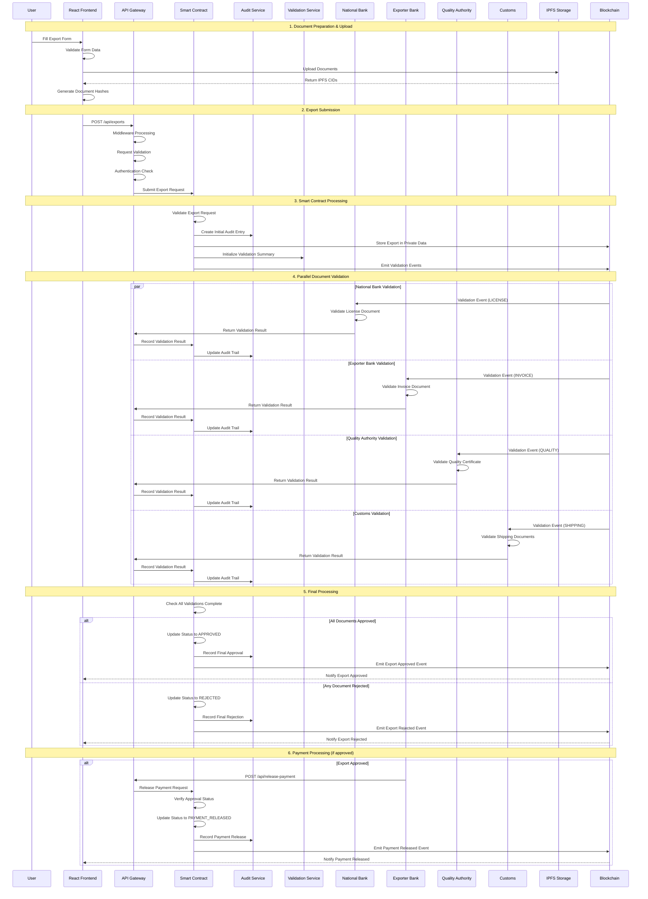
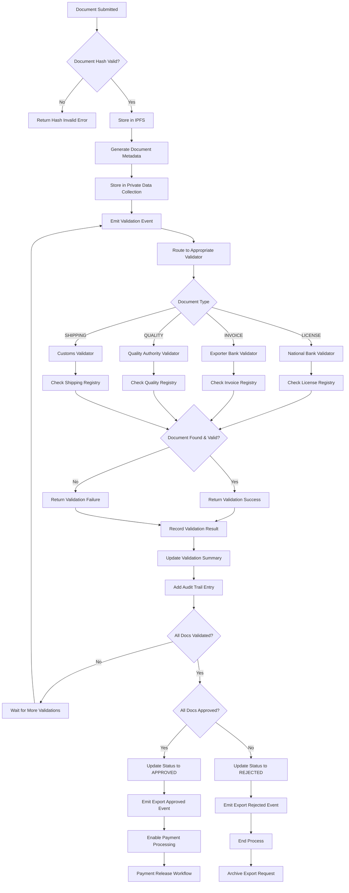
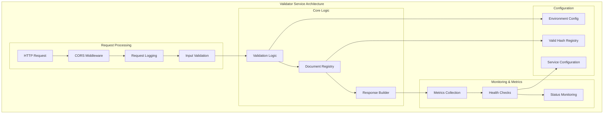
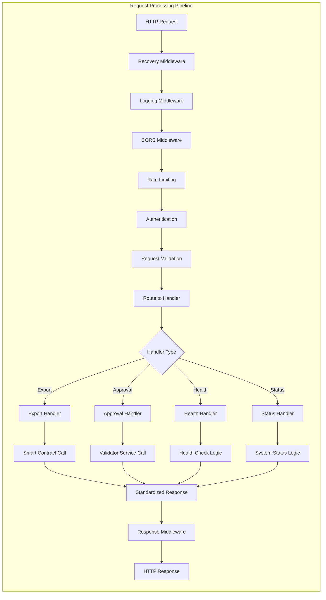
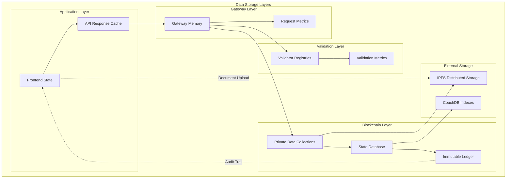
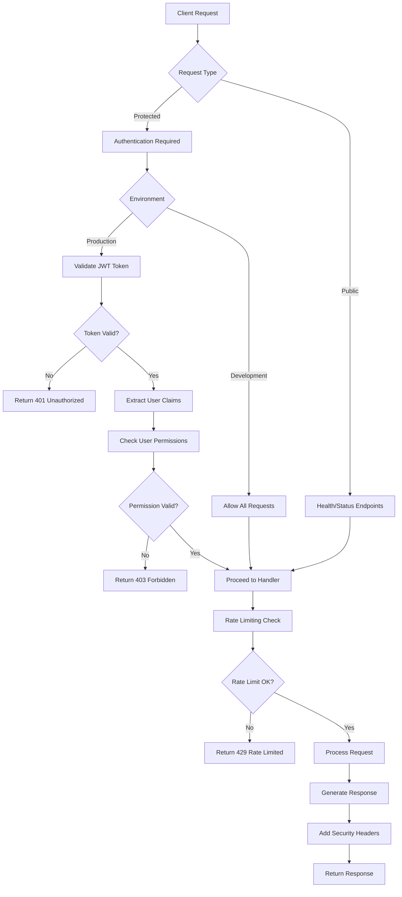
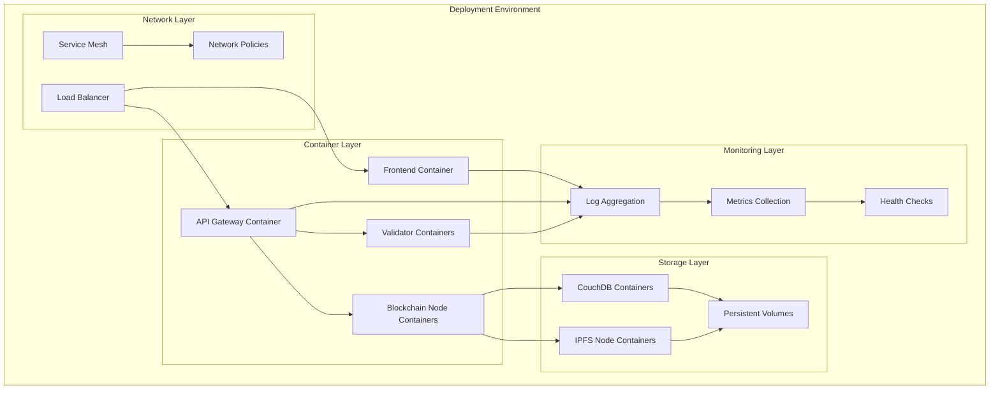

# Coffee Export System - Enhanced Workflow Documentation

## 🏗️ System Architecture Overview

The refactored Coffee Export System follows a layered architecture with clear separation of concerns and standardized interfaces.

## 📊 High-Level Architecture Diagram



```mermaid
graph TB
    subgraph "Presentation Layer"
        UI[React Frontend]
        ExportForm[Export Form Component]
        ApproversPanel[Approvers Panel]
        Dashboard[Dashboard Components]
    end
    
    subgraph "API Gateway Layer"
        Gateway[API Gateway]
        Middleware[Middleware Stack]
        subgraph "Middleware Components"
            Recovery[Recovery Middleware]
            Logging[Logging Middleware]
            CORS[CORS Middleware]
            RateLimit[Rate Limiting]
            Auth[Authentication]
        end
    end
    
    subgraph "Validation Services Layer"
        NBValidator[National Bank Validator]
        BankValidator[Exporter Bank Validator]
        QualityValidator[Quality Authority Validator]
        CustomsValidator[Customs Validator]
    end
    
    subgraph "Blockchain Layer"
        SmartContract[Smart Contract v2.0]
        subgraph "Smart Contract Services"
            ValidationSvc[Validation Service]
            AuditSvc[Audit Service]
            PaymentSvc[Payment Service]
        end
        SharedUtils[Shared Blockchain Utils]
    end
    
    subgraph "Storage Layer"
        IPFS[IPFS Storage]
        PrivateData[Private Data Collections]
        BlockchainLedger[Blockchain Ledger]
        CouchDB[CouchDB State Database]
    end
    
    subgraph "Infrastructure Layer"
        Docker[Docker Containers]
        Network[Hyperledger Fabric Network]
        Monitoring[Health & Metrics]
    end
    
    UI --> Gateway
    Gateway --> Middleware
    Middleware --> Recovery
    Middleware --> Logging
    Middleware --> CORS
    Middleware --> RateLimit
    Middleware --> Auth
    
    Gateway --> NBValidator
    Gateway --> BankValidator
    Gateway --> QualityValidator
    Gateway --> CustomsValidator
    
    Gateway --> SmartContract
    SmartContract --> ValidationSvc
    SmartContract --> AuditSvc
    SmartContract --> PaymentSvc
    SmartContract --> SharedUtils
    
    SmartContract --> IPFS
    SmartContract --> PrivateData
    SmartContract --> BlockchainLedger
    BlockchainLedger --> CouchDB
    
    NBValidator --> Docker
    BankValidator --> Docker
    QualityValidator --> Docker
    CustomsValidator --> Docker
    SmartContract --> Network
    
    Gateway --> Monitoring
    NBValidator --> Monitoring
    BankValidator --> Monitoring
    QualityValidator --> Monitoring
    CustomsValidator --> Monitoring
```

## 🔄 Enhanced Export Submission Workflow



## 📋 Document Approval Workflow



## 🔍 Validation Service Architecture



## 🏃 API Gateway Request Flow



## 📊 Data Flow Architecture



## 🔐 Security & Authentication Flow



## 📈 Monitoring & Health Check Architecture

```mermaid
graph TB
    subgraph "Monitoring Stack"
        subgraph "Service Level"
            HealthEndpoints[/health Endpoints]
            MetricsEndpoints[/metrics Endpoints]
            StatusEndpoints[/status Endpoints]
        end
        
        subgraph "Application Level"
            RequestMetrics[Request Metrics]
            ResponseTimes[Response Times]
            ErrorRates[Error Rates]
            BusinessMetrics[Business Metrics]
        end
        
        subgraph "Infrastructure Level"
            ContainerHealth[Container Health]
            NetworkHealth[Network Health]
            StorageHealth[Storage Health]
        end
        
        subgraph "Alerting"
            HealthDashboard[Health Dashboard]
            Alerts[Alert System]
            Notifications[Notifications]
        end
    end
    
    HealthEndpoints --> RequestMetrics
    MetricsEndpoints --> ResponseTimes
    StatusEndpoints --> ErrorRates
    
    RequestMetrics --> BusinessMetrics
    ResponseTimes --> BusinessMetrics
    ErrorRates --> BusinessMetrics
    
    BusinessMetrics --> ContainerHealth
    ContainerHealth --> NetworkHealth
    NetworkHealth --> StorageHealth
    
    StorageHealth --> HealthDashboard
    HealthDashboard --> Alerts
    Alerts --> Notifications
```

## 🚀 Deployment Architecture



## 📝 Summary

The enhanced workflow documentation provides:

1. **Clear Architecture Overview**: Layered architecture with defined responsibilities
2. **Detailed Process Flows**: Step-by-step workflows for all major operations
3. **Service Interactions**: How components communicate and integrate
4. **Data Flow Patterns**: How data moves through the system
5. **Security Models**: Authentication and authorization flows
6. **Monitoring Strategy**: Health checks and metrics collection
7. **Deployment Topology**: Container and infrastructure architecture

This documentation serves as a comprehensive guide for developers, operators, and stakeholders to understand the refactored system's architecture and workflows.