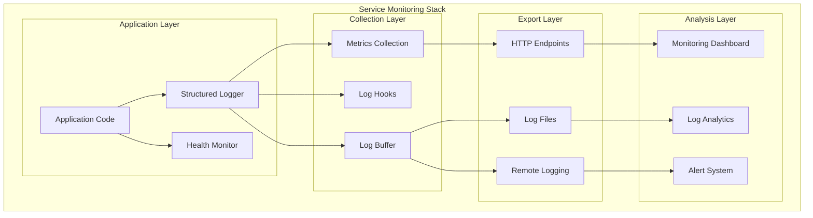
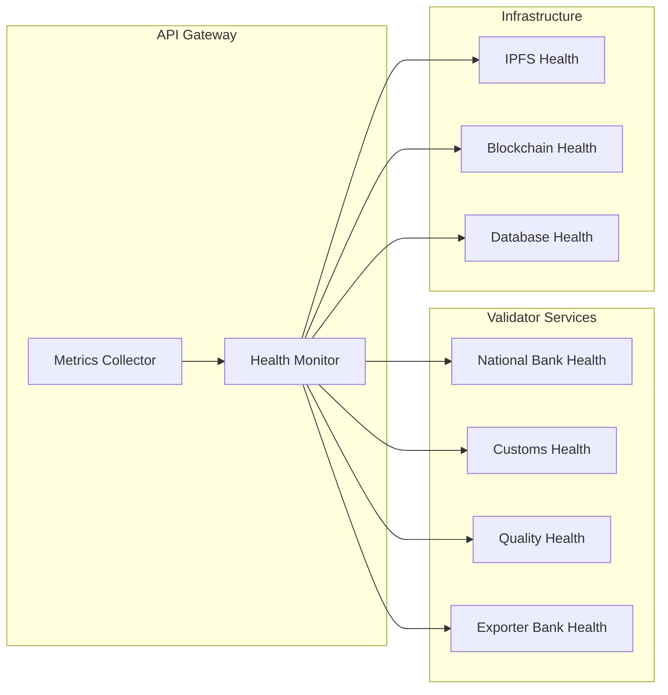

# Comprehensive Logging and Monitoring System

## 🎯 Overview

This document outlines the comprehensive logging and monitoring system implemented across all Coffee Export Platform services. The system provides structured logging, health monitoring, performance metrics, and real-time system status tracking.

## 🏗️ Architecture Components

### 1. Backend Logging Infrastructure (Go Services)

**Location**: `chaincode/shared/logging.go`

#### Features:
- **Structured Logging**: JSON-formatted logs with consistent schema
- **Multiple Log Levels**: DEBUG, INFO, WARN, ERROR, FATAL
- **Context-Aware Logging**: Request ID, User ID, Operation tracking
- **Performance Tracking**: Operation duration monitoring
- **Metrics Collection**: Automatic metrics extraction from logs
- **Multi-Output Support**: Console, file, and remote logging
- **Hook System**: Extensible logging with custom hooks

#### Log Entry Format:
```json
{
  "timestamp": "2024-08-27T10:30:00Z",
  "level": "INFO",
  "service": "api-gateway",
  "message": "Request completed successfully",
  "requestId": "req-123456789",
  "userId": "user-abc123",
  "operation": "export-submission",
  "duration": "250ms",
  "metadata": {
    "statusCode": 200,
    "responseSize": 1024
  },
  "environment": "production"
}
```

#### Usage Examples:
```go
// Initialize logger
logger := shared.NewLogger("api-gateway", "production")

// Contextual logging
logger.WithRequestID("req-123").WithUserID("user-456").Info("Processing export request")

// Performance tracking
ctx := logger.StartOperation("document-validation")
// ... perform operation
logger.EndOperation(ctx, true, map[string]interface{}{"documentCount": 4})

// Error logging with context
logger.WithError(err).Error("Failed to validate document")
```

### 2. Health Monitoring System (Go Services)

**Location**: `chaincode/shared/monitoring.go`

#### Features:
- **Comprehensive Health Checks**: Basic, memory, goroutine, dependency checks
- **System Metrics**: CPU, memory, goroutine monitoring
- **HTTP Metrics**: Request count, success rate, response times
- **Dependency Monitoring**: External service health checks
- **Performance Baselines**: Threshold-based health assessment
- **Health History**: Historical health data tracking

#### Health Check Types:

##### 1. Basic Health Check
```go
// Verifies service is running and responsive
func (hm *HealthMonitor) basicHealthCheck(ctx context.Context) *HealthCheck {
    // Service availability check
}
```

##### 2. Memory Health Check
```go
// Monitors memory usage and GC statistics
func (hm *HealthMonitor) memoryHealthCheck(ctx context.Context) *HealthCheck {
    // Memory threshold monitoring
    // - Allocated memory < 512MB (healthy)
    // - System memory < 1GB (healthy)
    // - Above thresholds = degraded
}
```

##### 3. Dependency Health Check
```go
// Checks external service availability
func (ag *APIGateway) checkValidatorHealth(ctx context.Context, name string, config ValidatorEndpoint) *HealthCheck {
    // HTTP health check to validator services
    // - 200 OK = healthy
    // - 4xx = degraded
    // - 5xx or timeout = unhealthy
}
```

#### Health Status Levels:
- **Healthy**: All systems operating normally
- **Degraded**: Some issues but service still functional
- **Unhealthy**: Critical issues affecting service functionality
- **Unknown**: Unable to determine health status

### 3. Frontend Logging System (TypeScript)

**Location**: `frontend/src/utils/logging.ts`

#### Features:
- **Client-Side Logging**: Comprehensive browser-based logging
- **Performance Monitoring**: Core Web Vitals and custom metrics
- **User Interaction Tracking**: Click, navigation, form submission tracking
- **Error Boundary Integration**: React error boundary logging
- **Automatic Buffer Management**: Periodic log flushing to server
- **Offline Support**: Local storage backup for failed log sends

#### Frontend Metrics Tracked:
```typescript
interface PerformanceMetrics {
  pageLoadTime: number;
  firstContentfulPaint: number;
  largestContentfulPaint: number;
  firstInputDelay: number;
  cumulativeLayoutShift: number;
  memoryInfo: any;
}

interface UserInteractionMetrics {
  clickEvents: number;
  formSubmissions: number;
  navigations: number;
  errors: number;
  sessionDuration: number;
  pageViews: number;
}
```

#### Usage Examples:
```typescript
import { log, initializeLogger } from '@/utils/logging';

// Initialize logger
initializeLogger('coffee-export-frontend', 'production', '2.0.0', '/api/logs');

// Basic logging
log.info('Export form submitted', { exportId: 'EXP-123' });
log.error('API call failed', error, { endpoint: '/api/exports' });

// Performance logging
const startTime = performance.now();
// ... perform operation
log.performance('document-upload', startTime, { fileSize: 1024000 });

// User interaction logging
log.userAction('click', 'submit-button', { formValid: true });

// API call logging
log.apiCall('POST', '/api/exports', 201, 250, 'req-123');
```

### 4. API Gateway Monitoring Integration

**Location**: `api-gateway/main.go`

#### Enhanced Middleware:
- **Structured Request Logging**: Every request logged with context
- **Performance Tracking**: Request duration monitoring
- **Error Recovery**: Panic recovery with structured logging
- **Health Endpoints**: `/health`, `/metrics`, `/status`

#### Monitoring Endpoints:

##### 1. Health Endpoint (`/health`)
```json
{
  "status": "healthy",
  "timestamp": "2024-08-27T10:30:00Z",
  "service": "api-gateway",
  "version": "2.0.0",
  "uptime": "2h30m15s",
  "checks": {
    "basic": { "status": "healthy", "duration": "1ms" },
    "memory": { "status": "healthy", "duration": "2ms" }
  },
  "dependencies": {
    "validator-national_bank": { "status": "healthy", "duration": "50ms" },
    "validator-customs": { "status": "healthy", "duration": "45ms" }
  },
  "metrics": {
    "cpu": { "cores": 4, "usage": 15.5 },
    "memory": { "used": 128000000, "percent": 12.5 },
    "goroutines": 25,
    "http": {
      "requestsTotal": 1250,
      "requestsSuccess": 1200,
      "requestsFailed": 50,
      "avgResponseTime": 125.5
    }
  }
}
```

##### 2. Metrics Endpoint (`/metrics`)
```json
{
  "service": "api-gateway",
  "version": "2.0.0",
  "timestamp": 1693132200,
  "logMetrics": {
    "log.info.count": { "count": 1000, "updatedAt": "2024-08-27T10:30:00Z" },
    "log.error.count": { "count": 25, "updatedAt": "2024-08-27T10:29:45Z" },
    "duration.export-submission.ms": { "count": 50, "lastValue": 250.5 }
  },
  "healthHistory": {
    "totalChecks": 100,
    "recent": { "healthy": 8, "degraded": 2, "unhealthy": 0 }
  }
}
```

##### 3. Status Endpoint (`/status`)
```json
{
  "service": "api-gateway",
  "status": "healthy",
  "configuration": {
    "authEnabled": true,
    "rateLimitEnabled": true,
    "corsOrigins": 2,
    "validators": 4
  },
  "dependencies": { /* dependency status */ },
  "metrics": { /* system metrics */ }
}
```

## 📊 Monitoring Architecture

### 1. Service-Level Monitoring



### 2. Cross-Service Health Monitoring



## 🔧 Configuration and Setup

### 1. Environment Variables

#### Backend Services:
```bash
# Logging configuration
LOG_LEVEL=INFO
LOG_FORMAT=json
LOG_DIRECTORY=./logs
LOG_MAX_SIZE=10m
LOG_MAX_FILES=14

# Monitoring configuration
HEALTH_CHECK_INTERVAL=30000
METRICS_ENABLED=true
METRICS_PORT=9090

# Performance thresholds
PERF_RESPONSE_TIME_THRESHOLD=5000
PERF_ERROR_RATE_THRESHOLD=5
PERF_MEMORY_THRESHOLD=90
PERF_CPU_THRESHOLD=80
```

#### Frontend Services:
```bash
# Frontend logging
REACT_APP_LOG_ENDPOINT=http://localhost:8000/api/logs
REACT_APP_LOG_LEVEL=INFO
REACT_APP_ENABLE_ANALYTICS=true

# Performance monitoring
REACT_APP_ENABLE_PERFORMANCE_MONITORING=true
REACT_APP_METRICS_ENDPOINT=http://localhost:8000/api/metrics
```

### 2. Service Integration

#### Go Services Integration:
```go
package main

import "github.com/chaincode/shared"

func main() {
    // Initialize logger
    shared.InitDefaultLogger("my-service", "production")
    logger := shared.GetDefaultLogger()
    
    // Initialize health monitor
    monitor := shared.NewHealthMonitor("my-service", "2.0.0", "production")
    
    // Add custom health checks
    monitor.AddCheck("database", func(ctx context.Context) *shared.HealthCheck {
        // Custom database health check
        return &shared.HealthCheck{
            Name:   "database",
            Status: shared.HealthStatusHealthy,
            Message: "Database connection successful",
        }
    })
    
    // Start monitoring
    ctx := context.Background()
    monitor.Start(ctx)
    
    // Use structured logging
    logger.WithOperation("startup").Info("Service starting")
}
```

#### React Application Integration:
```typescript
import React from 'react';
import { initializeLogger, log } from '@/utils/logging';

// Initialize logging in main.tsx
const logger = initializeLogger(
  'coffee-export-frontend',
  process.env.NODE_ENV,
  process.env.REACT_APP_VERSION,
  process.env.REACT_APP_LOG_ENDPOINT
);

// In components
const ExportForm: React.FC = () => {
  const handleSubmit = async (data: FormData) => {
    const startTime = performance.now();
    
    try {
      log.info('Export form submission started', { formData: data });
      
      const result = await submitExport(data);
      
      log.performance('export-submission', startTime, { 
        success: true, 
        exportId: result.id 
      });
      
      log.userAction('submit', 'export-form', { success: true });
      
    } catch (error) {
      log.error('Export submission failed', error, { formData: data });
      log.userAction('submit', 'export-form', { success: false });
    }
  };
};
```

## 📈 Performance Monitoring

### 1. Backend Performance Metrics

#### Key Metrics Tracked:
- **Response Time**: HTTP request duration
- **Throughput**: Requests per second
- **Error Rate**: Percentage of failed requests
- **Memory Usage**: Heap allocation and GC stats
- **Goroutine Count**: Concurrency monitoring
- **Database Connections**: Connection pool monitoring

#### Thresholds and Alerts:
```go
// Performance thresholds
const (
    ResponseTimeThreshold = 5 * time.Second     // 5s response time
    ErrorRateThreshold    = 5.0                 // 5% error rate
    MemoryThreshold       = 90.0                // 90% memory usage
    GoroutineThreshold    = 1000                // 1000 goroutines
)
```

### 2. Frontend Performance Metrics

#### Core Web Vitals:
- **Largest Contentful Paint (LCP)**: Loading performance
- **First Input Delay (FID)**: Interactivity
- **Cumulative Layout Shift (CLS)**: Visual stability
- **First Contentful Paint (FCP)**: Initial loading

#### Custom Metrics:
- **Page Load Time**: Complete page loading duration
- **API Response Time**: Backend service response times
- **User Session Duration**: Time spent in application
- **Error Frequency**: Client-side error occurrence

## 🚨 Alerting and Notification

### 1. Health-Based Alerts

#### Alert Conditions:
- **Service Unhealthy**: Critical service failure
- **High Error Rate**: Error rate > 5%
- **Slow Response Time**: Average response > 5s
- **Memory Pressure**: Memory usage > 90%
- **Dependency Failure**: External service unavailable

#### Alert Channels:
- **Log-Based**: Structured log entries for SIEM systems
- **HTTP Endpoints**: Webhook notifications
- **Dashboard**: Real-time status indicators

### 2. Custom Alert Implementation

```go
// Example alert hook
type AlertHook struct {
    webhookURL string
    threshold  map[string]float64
}

func (ah *AlertHook) Execute(entry *LogEntry) error {
    if entry.Level >= ERROR {
        // Send alert for error-level logs
        return ah.sendAlert(entry)
    }
    return nil
}

func (ah *AlertHook) sendAlert(entry *LogEntry) error {
    alert := map[string]interface{}{
        "service":   entry.Service,
        "level":     entry.Level,
        "message":   entry.Message,
        "timestamp": entry.Timestamp,
        "metadata":  entry.Metadata,
    }
    
    // Send to webhook endpoint
    return sendWebhook(ah.webhookURL, alert)
}
```

## 📊 Dashboard and Visualization

### 1. System Status Dashboard

The monitoring system provides real-time dashboards showing:

#### Service Health Overview:
- Overall system status (Healthy/Degraded/Unhealthy)
- Individual service health status
- Dependency health status
- Recent health check history

#### Performance Metrics:
- Request rate and response time trends
- Error rate monitoring
- Resource utilization (CPU, Memory)
- Custom business metrics

#### Log Analytics:
- Log volume by service and level
- Error frequency and patterns
- Performance bottleneck identification
- User activity monitoring

### 2. Example Dashboard Components

```typescript
// React component for system status
const SystemStatusDashboard: React.FC = () => {
  const [health, setHealth] = useState<SystemHealth>();
  
  useEffect(() => {
    const fetchHealth = async () => {
      const response = await fetch('/api/system-status');
      const data = await response.json();
      setHealth(data);
    };
    
    fetchHealth();
    const interval = setInterval(fetchHealth, 30000); // Update every 30s
    
    return () => clearInterval(interval);
  }, []);
  
  return (
    <div className="dashboard">
      <StatusIndicator status={health?.status} />
      <ServiceGrid services={health?.dependencies} />
      <MetricsCharts metrics={health?.metrics} />
    </div>
  );
};
```

## 🔍 Troubleshooting and Debugging

### 1. Log Analysis

#### Common Log Queries:
```bash
# Find all errors for a specific request
grep '"requestId":"req-123"' logs/*.json | grep '"level":"ERROR"'

# Monitor high response times
grep '"duration"' logs/*.json | jq 'select(.duration > 5000)'

# Track user session
grep '"userId":"user-456"' logs/*.json | sort -k timestamp
```

#### Structured Query Examples:
```sql
-- Example log analytics queries (if using log analytics platform)
SELECT COUNT(*) as error_count, service 
FROM logs 
WHERE level = 'ERROR' 
  AND timestamp > NOW() - INTERVAL 1 HOUR 
GROUP BY service;

SELECT AVG(CAST(metadata.duration as FLOAT)) as avg_response_time
FROM logs 
WHERE operation = 'export-submission' 
  AND timestamp > NOW() - INTERVAL 1 DAY;
```

### 2. Performance Analysis

#### Identifying Bottlenecks:
1. **Response Time Analysis**: Track operation durations
2. **Error Pattern Analysis**: Identify recurring error patterns
3. **Resource Usage Trends**: Monitor memory and CPU over time
4. **Dependency Health**: Track external service issues

#### Example Performance Investigation:
```go
// Log slow operations for analysis
func (logger *Logger) LogSlowOperation(operation string, duration time.Duration, threshold time.Duration) {
    if duration > threshold {
        logger.WithOperation(operation).
               WithContext("duration", duration.String()).
               WithContext("threshold", threshold.String()).
               Warn("Slow operation detected")
    }
}
```

## 🚀 Deployment and Operations

### 1. Production Deployment

#### Log Management:
- **Log Rotation**: Automatic log file rotation (daily, size-based)
- **Log Retention**: 14-day retention policy
- **Log Compression**: Gzip compression for archived logs
- **Remote Logging**: Centralized log aggregation

#### Monitoring Setup:
- **Health Check Intervals**: 30-second health checks
- **Metrics Collection**: 60-second metric intervals
- **Alert Thresholds**: Environment-specific thresholds
- **Dashboard Access**: Role-based access control

### 2. Scaling Considerations

#### High-Volume Logging:
- **Async Log Processing**: Non-blocking log operations
- **Buffer Management**: Configurable buffer sizes
- **Batch Processing**: Bulk log transmission
- **Circuit Breakers**: Prevent log system overload

#### Performance Impact:
- **Minimal Overhead**: < 1ms per log entry
- **Memory Efficient**: Bounded buffer sizes
- **Network Optimized**: Compressed log transmission
- **Graceful Degradation**: Fallback to local storage

## 📚 Best Practices

### 1. Logging Best Practices

#### Do's:
- Use structured logging with consistent schema
- Include relevant context (request ID, user ID, operation)
- Log at appropriate levels (avoid debug logs in production)
- Include performance metrics for critical operations
- Use correlation IDs for request tracing

#### Don'ts:
- Log sensitive information (passwords, tokens, PII)
- Create excessive log volume with debug information
- Block application execution with synchronous logging
- Ignore log buffer limits and memory constraints

### 2. Monitoring Best Practices

#### Health Check Design:
- Keep health checks lightweight and fast
- Include dependency checks for critical services
- Set appropriate timeouts for external checks
- Provide meaningful health check messages
- Implement gradual degradation strategies

#### Metrics Collection:
- Focus on actionable metrics
- Set realistic performance thresholds
- Monitor business metrics alongside technical metrics
- Implement trending and anomaly detection
- Regular review and adjustment of thresholds

## 🎉 Conclusion

The comprehensive logging and monitoring system provides:

- **Complete Visibility**: Full system observability across all services
- **Proactive Monitoring**: Early detection of issues and performance degradation
- **Structured Data**: Consistent, queryable log format for analysis
- **Performance Insights**: Detailed performance metrics and bottleneck identification
- **Operational Excellence**: Production-ready monitoring with alerts and dashboards

This monitoring infrastructure ensures the Coffee Export Platform operates reliably and provides the visibility needed for effective troubleshooting and optimization.