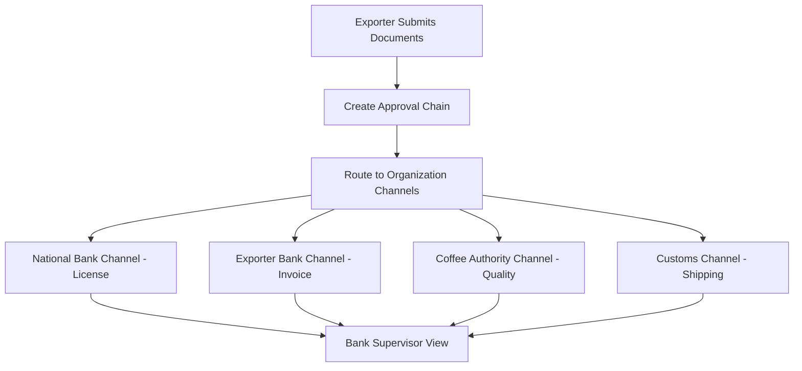
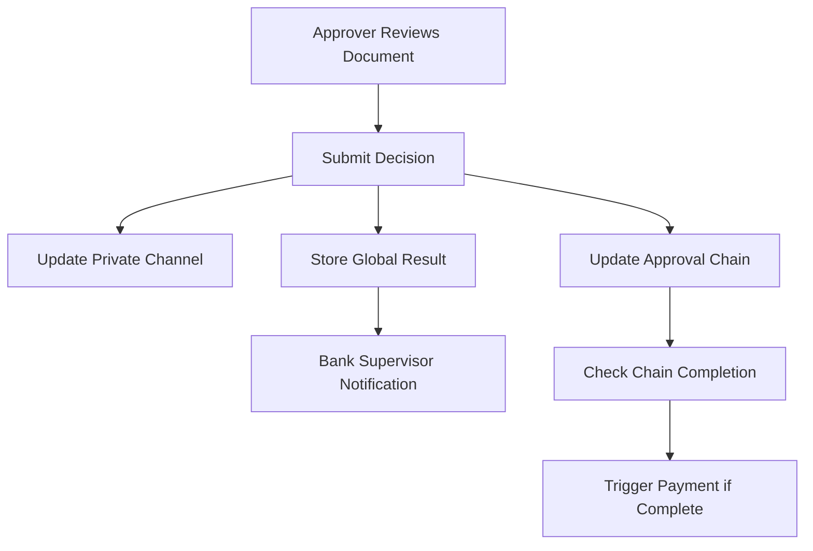

# Multi-Channel Approval System Implementation Guide

## 🎯 **Overview**

This document describes the complete refactoring of the coffee export document approval system to implement a **multi-channel approval architecture** with **dedicated private channels** for each approver organization and **bank supervisor oversight**.

## 🏗️ **System Architecture**

### **Key Components**

1. **ApprovalStage & ApprovalChain Models** - Sequential workflow management
2. **Private Approval Channels** - Organization-specific document isolation  
3. **Bank Supervisor Role** - Global oversight and monitoring
4. **Role-Based Access Control** - Granular permission system
5. **Multi-Channel API Endpoints** - Organization-specific data access
6. **Enhanced Frontend Interface** - Channel-aware user interface

## 📋 **Requirements Implementation**

### ✅ **Requirement 1: Dedicated Approval Channels**

**Implementation:**
- **Private Data Collections**: Each organization has a dedicated Hyperledger Fabric private data collection
- **Channel Isolation**: Documents are assigned to specific organizational channels based on document type
- **API Segregation**: Organization-specific endpoints ensure channel privacy

**Files Created/Modified:**
- `chaincode/shared/approval_models.go` - ApprovalChannel structure
- `chaincode/shared/approval_channel_manager.go` - Channel management logic
- `api-gateway/main.go` - Organization-specific API endpoints

**Channel Mapping:**
```
┌─────────────────────┬────────────────────────┬─────────────────────────┐
│ Organization        │ Document Type          │ Private Collection      │
├─────────────────────┼────────────────────────┼─────────────────────────┤
│ National Bank       │ Export License         │ approvalChannel_NATIONAL_BANK    │
│ Exporter Bank       │ Commercial Invoice     │ approvalChannel_EXPORTER_BANK    │
│ Coffee Authority    │ Quality Certificate    │ approvalChannel_COFFEE_AUTHORITY │
│ Customs             │ Shipping Documents     │ approvalChannel_CUSTOMS          │
└─────────────────────┴────────────────────────┴─────────────────────────┘
```

### ✅ **Requirement 2: Bank Supervisor Role**

**Implementation:**
- **Global Visibility**: Bank supervisors can access all export data through public ledger
- **Approval Timeline**: Complete audit trail of all approval activities
- **Progress Monitoring**: Real-time tracking of approval chain progress
- **Multi-Organization Overview**: Dashboard showing all active exports

**Supervisor Capabilities:**
```typescript
interface BankSupervisorView {
  exportId: string;
  exporterName: string;
  totalStages: number;
  completedStages: number;
  currentStage?: ApprovalStageInfo;
  overallStatus: 'PENDING' | 'APPROVED' | 'REJECTED' | 'IN_PROGRESS';
  documents: DocumentInfo[];
  lastActivity: string;
  timeline: ApprovalActivity[];
}
```

### ✅ **Requirement 3: Document Visibility Rules**

**Implementation:**
- **Role-Based Permissions**: Documents visible based on user role and organization
- **Approval Chain Access**: Bank supervisors see all documents regardless of stage
- **Channel-Specific Views**: Approvers only see documents assigned to their channel

**Access Control Matrix:**
```
┌─────────────────────┬─────────────────┬─────────────────┬─────────────────┐
│ Role                │ Own Docs        │ Assigned Docs   │ All Docs        │
├─────────────────────┼─────────────────┼─────────────────┼─────────────────┤
│ Exporter            │ ✅              │ ❌              │ ❌              │
│ Approver            │ ❌              │ ✅              │ ❌              │
│ Bank Supervisor     │ ✅              │ ✅              │ ✅              │
└─────────────────────┴─────────────────┴─────────────────┴─────────────────┘
```

## 🔧 **Technical Implementation**

### **1. Data Models**

#### **ApprovalChain Model**
```go
type ApprovalChain struct {
    ID            string                    `json:"id"`
    ExportID      string                    `json:"exportId"`
    ExporterMSP   string                    `json:"exporterMsp"`
    Stages        []ApprovalStage           `json:"stages"`
    CurrentStage  int                       `json:"currentStage"`
    OverallStatus ApprovalStageStatus       `json:"overallStatus"`
    CreatedAt     time.Time                 `json:"createdAt"`
    UpdatedAt     time.Time                 `json:"updatedAt"`
    CompletedAt   *time.Time                `json:"completedAt"`
}
```

#### **ApprovalStage Model**
```go
type ApprovalStage struct {
    ID             string              `json:"id"`
    ExportID       string              `json:"exportId"`
    DocumentType   DocumentType        `json:"documentType"`
    Organization   OrganizationType    `json:"organization"`
    StageOrder     int                 `json:"stageOrder"`
    Status         ApprovalStageStatus `json:"status"`
    AssignedTo     string              `json:"assignedTo"`
    ReviewedBy     string              `json:"reviewedBy"`
    ReviewDate     *time.Time          `json:"reviewDate"`
    Comments       string              `json:"comments"`
    RequiredFields []string            `json:"requiredFields"`
    CreatedAt      time.Time           `json:"createdAt"`
    UpdatedAt      time.Time           `json:"updatedAt"`
}
```

### **2. API Endpoints**

#### **Organization-Specific Channels**
- `GET /api/approval-channels/pending?org={organization}` - Get pending approvals for organization
- `POST /api/approval-channels/submit-decision?org={organization}` - Submit approval decision

#### **Bank Supervisor Endpoints**
- `GET /api/supervisor/exports` - Get all exports for supervision
- `GET /api/supervisor/export/{exportId}` - Get detailed export view
- `GET /api/approval-chain/{exportId}` - Get complete approval chain

### **3. Smart Contract Functions**

#### **Multi-Channel Functions**
```go
// Submit approval decision through organization channel
func (s *SmartContract) SubmitApprovalDecision(
    ctx contractapi.TransactionContextInterface,
    exportID string,
    documentType string,
    decision string,
    comments string,
    reviewedBy string,
) error

// Get pending approvals for specific organization
func (s *SmartContract) GetPendingApprovalsForOrganization(
    ctx contractapi.TransactionContextInterface,
    organization string,
) ([]byte, error)

// Bank supervisor global view
func (s *SmartContract) GetBankSupervisorView(
    ctx contractapi.TransactionContextInterface,
    exportID string,
) ([]byte, error)
```

### **4. Frontend Components**

#### **MultiChannelApproversPanel**
- **Organization Selection**: Choose specific organizational channel
- **Role-Based Interface**: Different views for approvers vs supervisors
- **Real-time Updates**: Polling for new assignments every 30 seconds
- **Approval Workflow**: Integrated decision submission with comments

#### **Enhanced ApproversApp**
- **Role Switching**: Support for multiple roles within organizations (especially Exporter Bank)
- **Channel Indicators**: Visual representation of private channels
- **Permission Awareness**: UI adapts based on user permissions

## 🔒 **Security & Access Control**

### **Permission System**

#### **MSP-Based Authorization**
```go
// Enhanced auth permissions
const (
    ViewAllExports      Action = "ViewAllExports"
    ViewApprovalChannel Action = "ViewApprovalChannel"  
    ManageApprovalChain Action = "ManageApprovalChain"
    SupervisorAccess    Action = "SupervisorAccess"
)
```

#### **Channel Access Control**
```go
// Channel access verification
func (a *AuthUtils) CheckChannelAccess(
    ctx contractapi.TransactionContextInterface, 
    mspID string, 
    channelOrg string
) (bool, error)

// Document visibility verification  
func (a *AuthUtils) CheckDocumentVisibility(
    ctx contractapi.TransactionContextInterface,
    mspID string, 
    exporterMSP string, 
    documentType string
) (bool, error)
```

### **Data Isolation**

#### **Private Data Collections**
- **Per-Organization Collections**: Each organization has dedicated storage
- **Cross-Channel Visibility**: Controlled through smart contract logic
- **Audit Trail**: Public ledger maintains approval results for supervision

## 🚀 **Usage Guide**

### **For Approvers**

1. **Access Organization Channel**
   ```bash
   # Navigate to approvers interface
   http://localhost:3001/approvers
   
   # Select your organization
   # View pending documents in your private channel
   ```

2. **Review Documents**
   - Documents appear only for your organization's document types
   - Access original document content through IPFS
   - Submit approval/rejection with mandatory comments

3. **Monitor Progress**
   - View approval status in real-time
   - Track your organization's approval metrics

### **For Bank Supervisors**

1. **Access Supervisor Dashboard**
   ```bash
   # Select Exporter Bank organization
   # Choose "Bank Supervisor" role
   ```

2. **Global Oversight**
   - View all active exports across organizations
   - Monitor approval chain progress
   - Access complete approval timeline
   - View document details from all channels

3. **Export Analysis**
   - Click on any export for detailed view
   - Review approval activities and comments
   - Track bottlenecks in approval process

### **For Exporters**

1. **Document Submission**
   - Submit documents through existing export form
   - Documents automatically routed to appropriate channels
   - Receive real-time approval status updates

2. **Progress Tracking**
   - Monitor which organization is currently reviewing
   - View approval timeline and comments
   - Access approved/rejected document feedback

## 📊 **Data Flow**

### **Export Submission Flow**


### **Approval Decision Flow**


## 🧪 **Testing the System**

### **1. Start the Platform**
```bash
cd c:\Users\EliasBekeleWirtu\Desktop\master\coffexapi
.env.bat
docker-compose up --build
```

### **2. Test Organization Channels**
```bash
# Test National Bank channel
curl "http://localhost:8000/api/approval-channels/pending?org=national-bank"

# Test Bank Supervisor view
curl -H "X-User-Role: BANK_SUPERVISOR" "http://localhost:8000/api/supervisor/exports"
```

### **3. Frontend Testing**
1. **Navigate to**: `http://localhost:3001/approvers`
2. **Select Organization**: Choose from 4 organization types
3. **Switch Roles**: Test supervisor vs approver views (Exporter Bank)
4. **Submit Decisions**: Test approval workflow with comments

## 🔍 **Monitoring & Debugging**

### **Logs to Monitor**
- **Channel Assignment**: Check document routing to correct channels
- **Permission Checks**: Verify access control enforcement
- **Approval Chain Updates**: Monitor workflow progression
- **Supervisor Access**: Validate global visibility

### **Common Issues**
1. **Channel Access Denied**: Verify MSP ID matches organization
2. **Missing Permissions**: Check role-based access configuration
3. **Document Not Visible**: Verify channel assignment logic
4. **Supervisor View Empty**: Confirm supervisor role permissions

## 📈 **Benefits Achieved**

### **For Organizations**
- ✅ **Privacy**: Each organization has isolated document view
- ✅ **Security**: Private channels prevent cross-organization data leaks  
- ✅ **Efficiency**: Only relevant documents appear in approval queue
- ✅ **Auditability**: Complete approval history maintained

### **For Bank Supervisors**
- ✅ **Global Oversight**: Complete visibility across all exports
- ✅ **Progress Monitoring**: Real-time approval chain tracking
- ✅ **Risk Management**: Early identification of approval bottlenecks
- ✅ **Compliance**: Full audit trail for regulatory requirements

### **For Exporters**
- ✅ **Transparency**: Clear visibility of approval progress
- ✅ **Efficiency**: Parallel processing through multiple channels
- ✅ **Reliability**: No single point of failure in approval process
- ✅ **Trust**: Blockchain immutability ensures decision integrity

## 🔮 **Future Enhancements**

1. **Advanced Routing**: Dynamic channel assignment based on document characteristics
2. **Approval Templates**: Pre-configured approval stages for different export types
3. **SLA Monitoring**: Automatic escalation for delayed approvals
4. **Advanced Analytics**: ML-powered approval prediction and optimization
5. **Mobile Support**: Native mobile apps for approvers
6. **Integration APIs**: Third-party system integration capabilities

---

**Implementation Complete** ✅

The multi-channel approval system is now fully implemented with dedicated private channels for each approver organization, comprehensive bank supervisor oversight, and robust role-based access control. The system maintains document privacy while ensuring complete transparency for authorized supervisors.